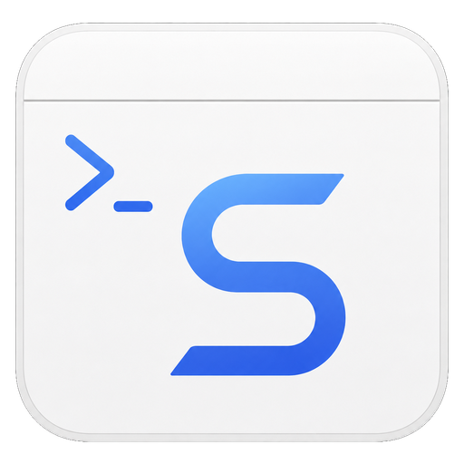
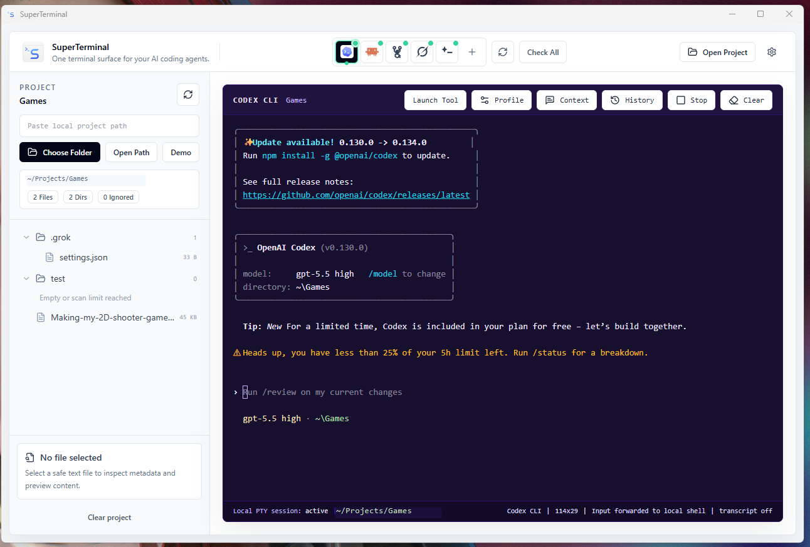

# SuperTerminal

<p align="center">
  
</p>

One terminal surface for your AI coding agents.



## What is SuperTerminal?

SuperTerminal is a local-first desktop app that gives developers one common terminal surface for AI coding agents and CLI tools such as Codex CLI, Claude Code/CLI, OpenCode, OpenClaude-compatible tools, Grok-compatible tools, and custom CLIs.

It does not replace those tools. It provides a richer interface around them: project-aware terminal sessions, tool profiles, context injection, guided installation, session history, and local configuration.

SuperTerminal is currently in public alpha. Expect rough edges, especially around platform-specific terminal behavior and unsigned installers.

## Features

Currently supports:

- Open a local project folder and browse files.
- Preview safe text files without reading secret/env files.
- Launch local shell sessions from the project root or user home.
- Configure AI coding agent profiles and command overrides.
- Detect installed CLI tools with short local version checks.
- Launch supported tools inside an embedded xterm.js terminal.
- Configure per-tool launch profiles, args, working directory behavior, and confirmation.
- Generate local project context for agents.
- Inject context through clipboard, prompt files, or stdin.
- Run guided tool installation with explicit confirmation and command validation.
- Store per-tool environment variables locally and pass them only to selected tool processes.
- Track sessions and optional bounded transcript previews.
- Keep workflows local-first and user-controlled.

## What SuperTerminal is not

SuperTerminal is not:

- A replacement for Codex, Claude, OpenCode, OpenClaude, Grok, or any other coding agent.
- A distributor or bundled package of third-party CLI tools.
- A cloud agent platform.
- An API key broker.
- A replacement for your existing terminal.
- A tool that silently installs software or runs commands without confirmation.

## Security & Privacy

SuperTerminal is local-first.

- SuperTerminal does not bundle third-party CLI tools.
- SuperTerminal does not manage cloud accounts or OAuth.
- API keys are stored locally and only passed to the selected tool process when configured by the user.
- Project context is not uploaded by SuperTerminal.
- Tool installation commands are shown clearly and require user confirmation.
- SuperTerminal does not intentionally include API keys in prompts, prompt files, diagnostics, or transcript previews.

Terminal output can still contain sensitive data if a tool prints it. Transcript capture is optional and should be enabled only when you are comfortable storing a bounded local preview.

## Third-Party Tools

SuperTerminal can detect, configure, and launch third-party CLI tools, but it does not bundle or redistribute them.

Third-party tools such as Codex, Claude, OpenCode, OpenClaude, Grok-compatible tools, and others remain governed by their own licenses, terms, and security policies.

## Third-Party Logos

Third-party names, logos, and trademarks shown in SuperTerminal are the property of their respective owners.

Their use is for identification and interoperability only and does not imply endorsement, sponsorship, or affiliation unless explicitly stated.

SuperTerminal does not bundle or redistribute third-party CLI tools.

## Installation

Public alpha installers will be published through GitHub Releases.

1. Go to the Releases page.
2. Download the latest build for your operating system.
3. Install and launch SuperTerminal.

> Note: Early builds may not be code-signed yet, so your operating system may show a warning.

If no release is available yet, build from source using the development instructions below.

## Development

Requirements:

- Node.js
- npm
- Rust and Cargo
- Tauri prerequisites for your operating system

Install dependencies:

```bash
npm install
```

Run the frontend only:

```bash
npm run dev
```

Run the desktop app in development:

```bash
npm run tauri:dev
```

Build the frontend:

```bash
npm run build
```

Build the desktop app:

```bash
npm run tauri:build
```

On Windows PowerShell, use `npm.cmd` instead of `npm` if script execution policy blocks npm shims.

## Contributing

Contributions are welcome.

By submitting a contribution, you agree that your contribution is licensed under the Apache License 2.0.

See [CONTRIBUTING.md](./CONTRIBUTING.md) for details.

## Roadmap

Planned work includes broader platform testing, stronger persisted settings, improved tool-specific profiles, more reliable transcript storage controls, and packaged public alpha builds.

## Branding

The SuperTerminal name, logo, and branding belong to the project owner and may not be used to misrepresent unofficial builds, forks, or distributions as the official SuperTerminal project.

## License

SuperTerminal is licensed under the Apache License 2.0.

See [LICENSE](./LICENSE) for details.

For security reporting guidance, see [SECURITY.md](./SECURITY.md).
